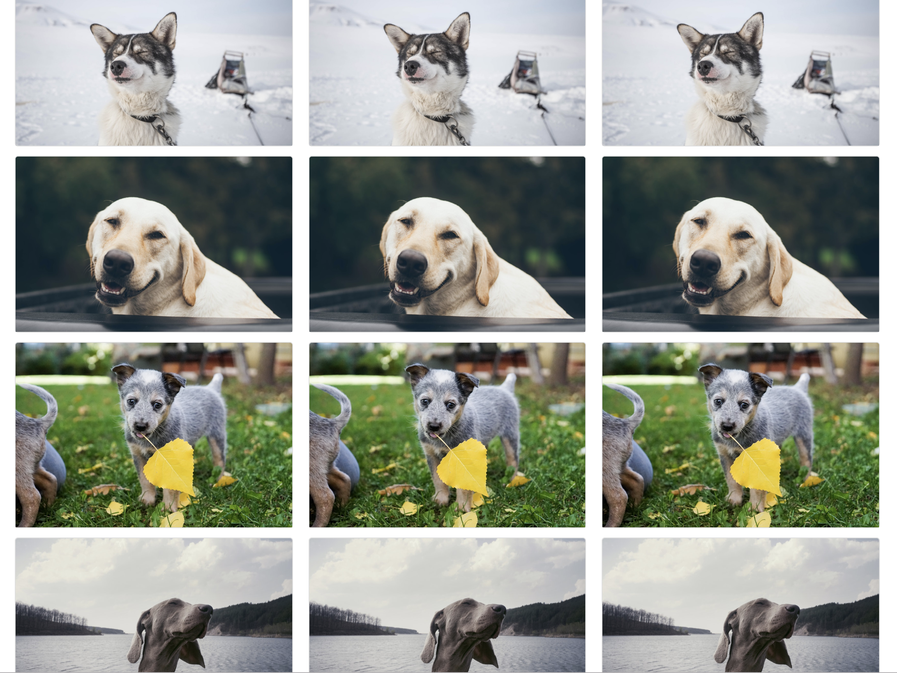

## Read me
This project is a simple gallery implementation that makes use of
some latest technology and programming techniques. The reason why
I chose React and Bootstrap is because the frameworks themselves are
quite powerful. React along with Webpack provide the entire local dev
environment. ES6 makes importing modules super easy and coding more
fun.

The project and issue tracking are setup on github
[https://github.com/kitkat729/asana-pets/projects/1](https://github.com/kitkat729/asana-pets/projects/1)
 
The design was inspired by unsplash. I also like pinterest.

The site was designed with responsive and good UX in mind. It has
infinite scroll and was optimized for mobile devices. I used the
same url to feed data multiple times. Don't be surprised if you see
duplicate images when running the project.

I also incorporate some SEO in the markup.
 
## Setup

In the project directory, you can run:

### `yarn install --frozen-lock`

This will install all the node modules required for the project

### `yarn start`

Runs the app in the development mode. 
Open [http://localhost:3000/gallery](http://localhost:3000/gallery)
to view the Gallery in the browser.

The page will reload if you make edits. 
You will also see any lint errors in the console.

Please reach out if you have any questions.
E: hoikityuen@gmail.com
